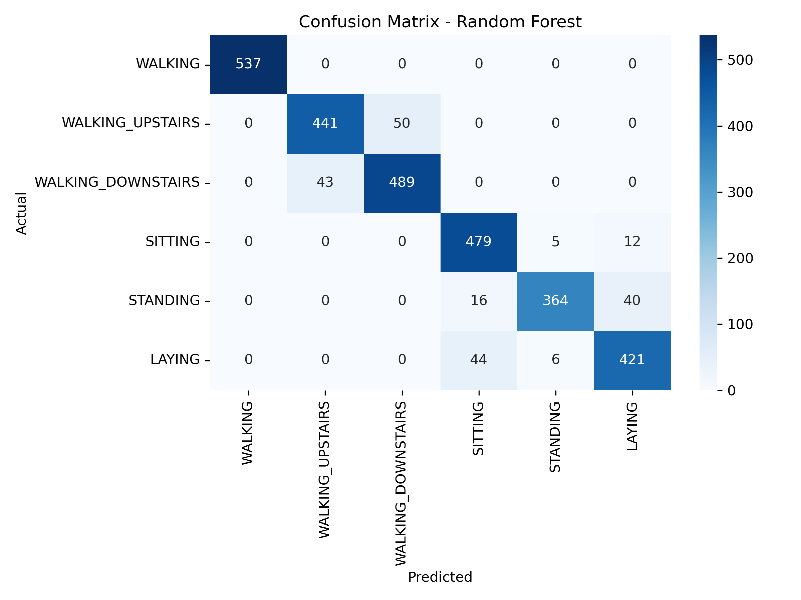
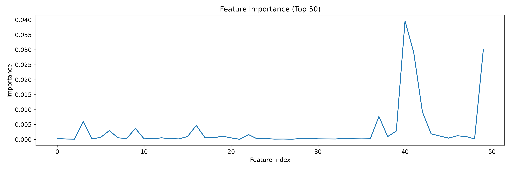
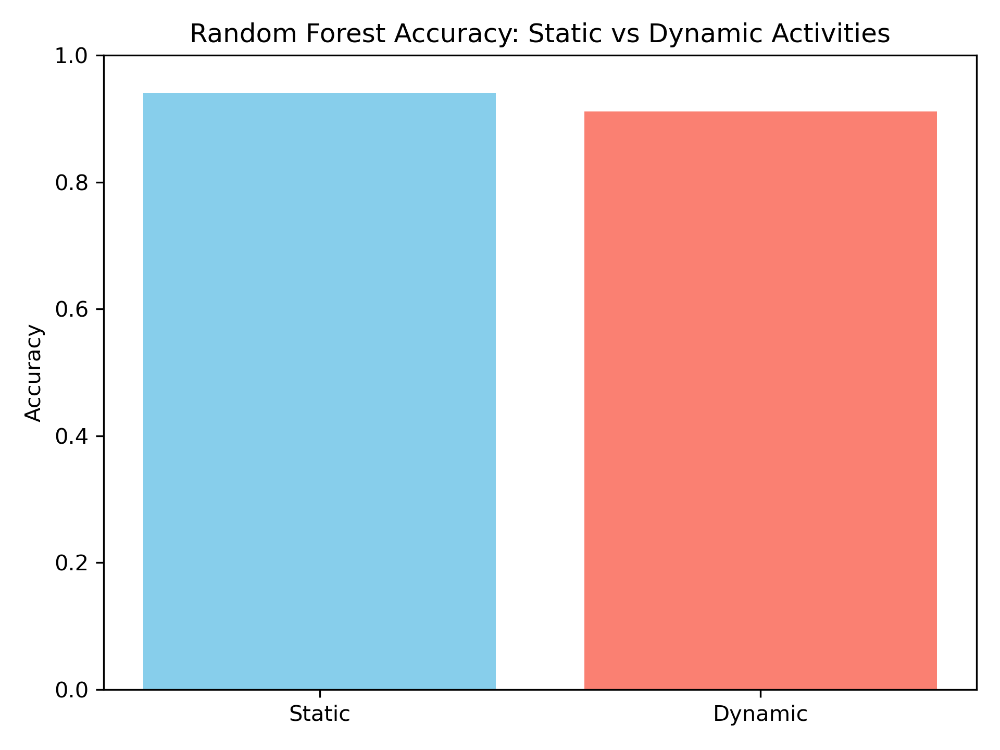

# Human Activity Recognition using Machine Learning

Classifying human activities from smartphone sensor data using classical Machine Learning techniques.
This project implements an end-to-end Human Activity Recognition (HAR) pipeline using smartphone accelerometer and gyroscope signals to identify everyday human activities such as walking, sitting, standing etc.

It was developed as a quick independent project during my Master's in AI & Robotics to demonstrate end-to-end ML workflow skills.

## Project Highlights

✓ End-to-end Machine Learning workflow  
✓ Sensor-based activity classification  
✓ Feature preprocessing and selection  
✓ Comparative model evaluation  
✓ Reproducible experimentation in Jupyter Notebook 

## 📊 Dataset

**Dataset:** UCI Human Activity Recognition Using Smartphones Dataset
🔗 https://archive.ics.uci.edu/dataset/240/human+activity+recognition+using+smartphones

### Dataset Overview
- Smartphone sensor data collected from participants
- Accelerometer and gyroscope signals
- Multiple labeled human activities
- Preprocessed feature representation


## 🧠 Objective

The objective of this project is to build a lightweight Human Activity Recognition (HAR) system using classical Machine Learning algorithms and evaluate model performance across multiple activity classes.

## ⚙️ Tech Stack

| Category | Tools |
|----------|-------|
| Language | Python |
| Environment | Jupyter Notebook |
| ML | Scikit-learn |
| Data Processing | Pandas, NumPy |
| Visualization | Matplotlib |

## 🚀 Workflow

```text
Sensor Data
   ↓
Data Preprocessing
   ↓
Feature Selection
   ↓
Model Training
   ↓
Performance Evaluation
   ↓
Result Comparison
```
### Models Implemented
- Random Forest Classifier
- Support Vector Machine (SVM)


## 📈 Results

The models successfully classify activities such as:

* Walking
* Sitting
* Standing
* Laying
* Upstairs/Downstairs

### Model Performance

| Model | Accuracy |
|-------|----------|
| Random Forest | INSERT_RF |
| SVM | INSERT_SVM |

🏆 Best Performing Model: **Random Forest**

### Confusion Matrix



Shows prediction performance across all activity classes.

---

### Feature Importance



Displays relative contribution of extracted sensor features.

---
### Static vs Dynamic Activities



Comparison of recognition performance across movement categories.

---

### Exported Results

CSV summary:

```text
har_results_summary.csv
```

## Repository Structure

```plaintext
human-activity-recognition-ml/
│
├── README.md
├── requirements.txt
├── .gitignore
├── human_activity_recognition.ipynb
├── features.txt
├── har_results_summary.csv
│
├── results/
│   ├── confusion_matrix_rf.png
│   ├── feature_importance.png
│   └── static_vs_dynamic_accuracy.png
│
├── dataset/
│   └── dataset_link.txt
│
└── images/
    └── workflow.png
```
## Installation

Clone the repository:

```bash
git clone https://github.com/SalouniDas/human-activity-recognition-ml.git
```

Move into the project:

```bash
cd human-activity-recognition-ml
```

Install dependencies:

```bash
pip install -r requirements.txt
```

Launch notebook:

```bash
jupyter notebook
```
## Future Improvements

- Hyperparameter optimization
- Deep Learning approaches (LSTM / CNN)
- Real-time activity recognition
- Model deployment as a web application
- Integration with wearable or robotic systems

## 🎓 Why I built this

This project was created to strengthen practical understanding of:

- Machine Learning pipelines
- Sensor data processing
- Classification techniques
- Experiment tracking
- Building reproducible AI projects

It also reflects my broader interest in **AI, intelligent systems, and assistive technologies**.


## 👩‍💻 Author
Salouni Das

